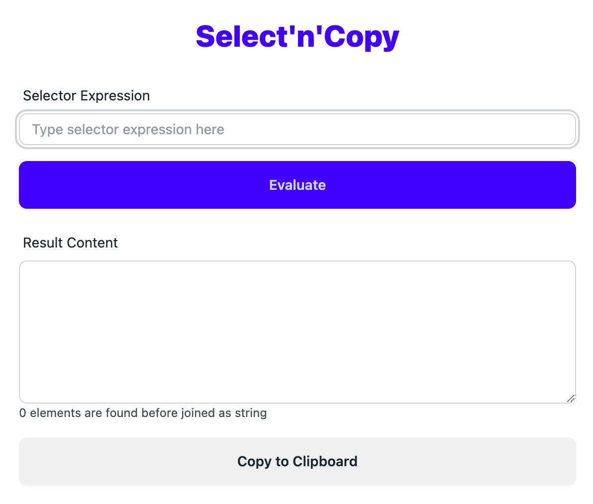
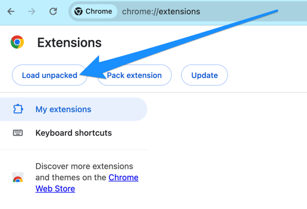

# Intro

This ia a **chrome extension** project.

Since my "Room Mate" often asks me to download movies for her, so I have to...

This **chrome extension** will copy links to clipboard for download software, let's say, Thunder... 

Formerly, I did such thing in DevTools of Chrome.

Since it's still tricky to debug the selector expressions and copy the result, I make this chrome extension.

# What it looks like

# About the author

[Fuqiang Wang](https://afoo.me/), call me Darren or Afoo if you would love to. 

[Follow me on X/Twitter](https://twitter.com/fujohnwang) is also preferred.

# How to install

Since I don't want to publish the extension to chrome store, if you would like to use it, just "Load unpacked" from the extension page and select "public" folder under this project as root:

# Further reading

I wrote a blog post on message passing in chrome extension, but in Chinese, you can turn to translation services for help, if you would like to read it ;)

[Chrome插件的消息通信机制探寻 (Message Passing in Chrome Extension)](https://afoo.me/posts/2023-12-28-chrome-extension-message-passing-basics.html)

